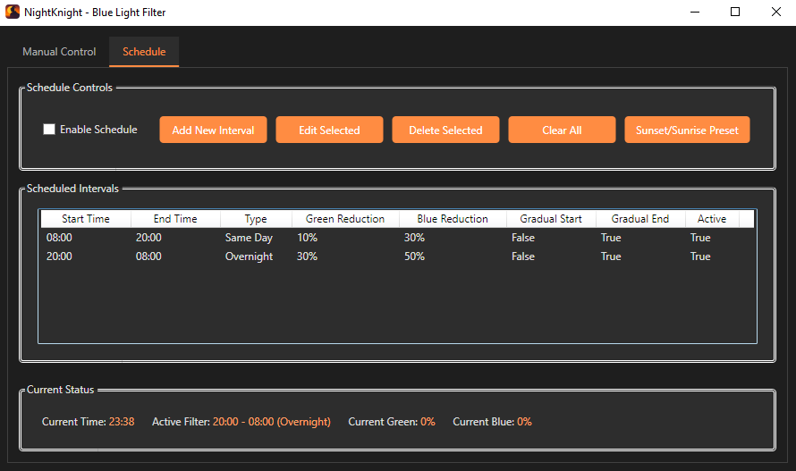

#  NightKnight

**NightKnight** is a lightweight Windows WPF app that helps users setup a blue and/or green light filter for their Windows device with a fully customizable scheduling system. 

By default, the schedule has a medium strength interval from 8 AM to 8 PM and a strong interval from 8 PM to 8 AM. These time intervals are fully customizable through the user interface.

## Features

- Supports blue light and green light filtering up to 50%.
- Includes a fully customizable scheduling system.
- Gradual transitions between intervals.
- Preset interval to match the sunset and sunrise times of your location.
- Simple and clean WPF GUI.

## How It Works

- Uses Windows API calls (`user32.dll`) to change the gamma values of the device's display.
- Written entirely in C# with WPF and .NET 9.

## Requirements

- Windows 10 or higher

## Known Limitations

- Scheduled intervals have a ~22 second delay.
- Filtering only goes up to 50%.

## License

MIT License. See LICENSE.md for details.
